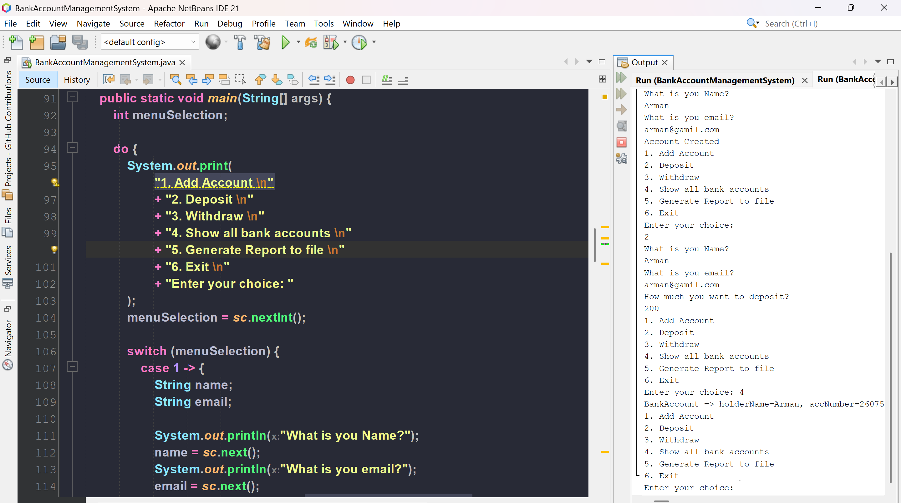
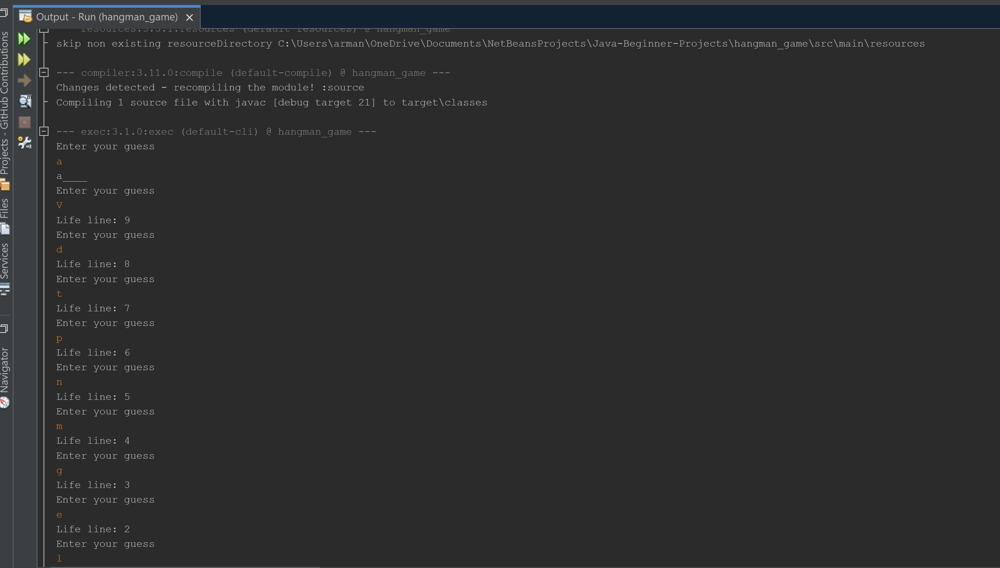

# My Awesome Project Collection 🚀

Welcome to my Git repository! This is a showcase of my coding journey, featuring a variety of projects that range from practical tools to fun games. Whether you're here to explore, collaborate, or get inspired, I’ve got something for everyone. Let’s dive in!

---

## 🌟 Featured Projects

Here’s a quick rundown of what you’ll find in this repository:

1. **AddressBook**  
   Keep your contacts organized with this simple yet powerful address management system.  
   _Tech Stack_: [Java]  
   

2. **BankAccountManagementSystem**  
   A robust system to manage bank accounts, transactions, and balances. Perfect for learning OOP concepts!  
   _Tech Stack_: [Java]  
   

3. **ExpenseTracker**  
   Track your spending and stay on budget with this handy tool.  
   _Tech Stack_: [Java,Swing]  
   

4. **GuessingGame**  
   A fun number-guessing game to test your luck and logic. Can you beat the odds?  
   _Tech Stack_: [Java]  
   

5. **Hangman_Game**  
   The classic word-guessing game with a twist. Save the hangman before it’s too late!  
   _Tech Stack_: [Java]  
   

---

## 🛠️ How to Get Started

1. **Clone the Repository**

   ```bash
   git clone https://github.com/yourusername/your-repo-name.git
   ```

2. **Navigate to a Project**

   ```bash
   cd ProjectName
   ```

3. **Follow Project-Specific Instructions**  
   Each project folder contains its own setup guide (if applicable). Check the individual files or documentation!

---

## 📸 Screenshots

Here’s a sneak peek at what you’re in for:

| Project        | Preview                                         |
| -------------- | ----------------------------------------------- |
| AddressBook    |        |
| ExpenseTracker |  |
| Hangman Game   |                |

---

## 💡 Why This Repository?

- **Learning**: Each project demonstrates different programming concepts and techniques.
- **Fun**: Games like Hangman and GuessingGame bring some play into coding.
- **Utility**: Tools like TaskManager and ExpenseTracker solve real-world problems.

---

## 🌐 Connect With Me

Got questions, suggestions, or just want to chat about code? Find me here:

- [Email](mailto:arman.bhatia.1407@gmail.com)

---

## 🚧 Future Plans

- Add more projects (suggestions welcome!).
- Improve documentation and add tutorials.
- Optimize code for performance and scalability.

---

_Built with ❤️ by Arman Bhatia._
